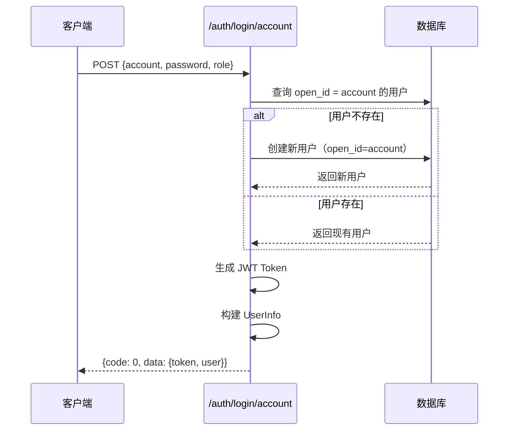

# 设计文档

## 概述

本设计文档描述账号密码登录功能的技术实现方案。该功能在现有微信登录基础上，新增一个账号密码登录端点，复用现有的用户模型和响应格式，确保与微信登录的一致性。

## 架构

### 系统架构

```
┌─────────────────┐     ┌─────────────────┐     ┌─────────────────┐
│   客户端        │────▶│   FastAPI       │────▶│   SQLite        │
│   (小程序/Web)  │     │   /auth/login   │     │   users 表      │
└─────────────────┘     │   /account      │     └─────────────────┘
                        └─────────────────┘
```

### 请求流程



## 组件和接口

### API 端点

**POST /auth/login/account**

新增账号密码登录端点，与现有微信登录端点 `/auth/login` 并行存在。

#### 请求参数

```python
class AccountLoginRequest(BaseModel):
    account: str = Field(..., description="用户账号")
    password: str = Field(..., description="用户密码（不校验）")
    role: str = Field(default="foodie", description="用户角色: foodie 或 chef")
```

#### 响应格式

与微信登录完全一致：

```python
{
    "code": 0,
    "message": "success",
    "data": {
        "token": "jwt_token_string",
        "user": {
            "id": "uuid",
            "nickname": "",
            "avatar": "",
            "phone": null,
            "role": "foodie",
            "binding_code": "ABC12345",
            "introduction": null,
            "specialties": null,
            "rating": 5.0,
            "total_orders": 0,
            "bound_chef": null
        }
    }
}
```

### 代码复用

1. **用户模型** - 复用现有 `User` 模型，将 `account` 存储在 `open_id` 字段
2. **响应格式** - 复用 `LoginResponse`、`UserInfo` schema
3. **辅助函数** - 复用 `_get_user_info()` 函数构建用户信息
4. **Token 生成** - 复用 `create_token()` 函数
5. **绑定码生成** - 复用 `generate_binding_code()` 函数

## 数据模型

### 用户存储策略

账号密码登录的用户与微信登录用户共用 `users` 表：

| 字段 | 微信登录 | 账号密码登录 |
|------|----------|--------------|
| open_id | 微信 openId | 用户账号 |
| nickname | 微信昵称/空 | 空字符串 |
| avatar | 微信头像/空 | 空字符串 |
| role | 请求指定 | 请求指定 |
| binding_code | 自动生成 | 自动生成 |

### 账号唯一性

由于 `open_id` 字段已设置 `unique=True` 约束，账号的唯一性由数据库保证。

## 正确性属性

*正确性属性是指在系统所有有效执行中都应保持为真的特征或行为——本质上是关于系统应该做什么的形式化陈述。属性作为人类可读规范和机器可验证正确性保证之间的桥梁。*

### 属性 1：密码无关性

*对于任意* 账号和任意两个不同的密码，使用相同账号但不同密码登录，应返回相同的用户信息（相同的用户 ID）。

**验证: 需求 1.1**

### 属性 2：账号唯一性

*对于任意* 账号，多次使用该账号登录，系统应始终返回相同的用户 ID，不会创建重复用户记录。

**验证: 需求 1.3, 1.4**

### 属性 3：响应结构完整性

*对于任意* 有效的账号密码登录请求，响应应包含 code=0、token 字段、以及包含所有必需字段（id、nickname、avatar、phone、role、binding_code、introduction、specialties、rating、total_orders、bound_chef）的 user 对象。

**验证: 需求 2.1, 2.2, 2.3, 2.4, 4.1**

### 属性 4：默认值正确性

*对于任意* 新创建的账号密码用户，其 nickname 应为空字符串，avatar 应为空字符串，rating 应为 5.0，total_orders 应为 0。

**验证: 需求 3.1, 3.2, 3.4, 3.5**

### 属性 5：角色参数正确性

*对于任意* 指定了有效角色（foodie 或 chef）的登录请求，创建的用户角色应与请求参数一致。

**验证: 需求 3.6**

## 错误处理

| 场景 | 错误码 | 错误信息 |
|------|--------|----------|
| 角色参数无效 | 400 | "Invalid role. Must be 'foodie' or 'chef'" |
| 账号为空 | 400 | "Account cannot be empty" |
| 数据库错误 | 500 | "Database error: {details}" |

## 测试策略

### 单元测试

1. **登录成功测试** - 验证新用户创建和现有用户登录
2. **响应格式测试** - 验证返回数据结构与微信登录一致
3. **默认值测试** - 验证新用户的默认字段值
4. **错误处理测试** - 验证无效输入的错误响应

### 属性测试

使用 Hypothesis 库进行属性测试：

1. **属性 1 测试** - 生成随机账号和两个不同密码，验证返回相同用户 ID
2. **属性 2 测试** - 生成随机账号，多次登录验证用户 ID 一致
3. **属性 3 测试** - 生成随机账号密码，验证响应包含所有必需字段
4. **属性 4 测试** - 生成随机新账号，验证默认值正确
5. **属性 5 测试** - 生成随机账号和角色，验证用户角色与请求一致

### 测试配置

- 属性测试库：Hypothesis
- 每个属性测试最少运行 100 次迭代
- 测试标签格式：**Feature: account-password-login, Property {number}: {property_text}**
